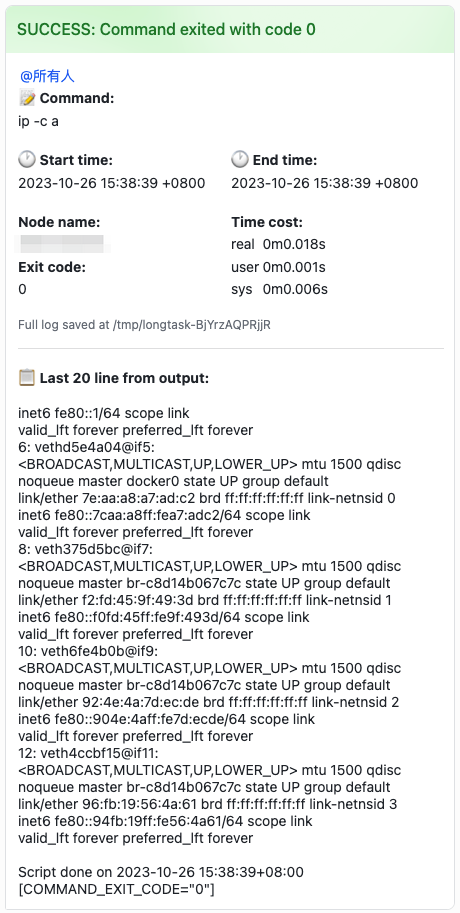
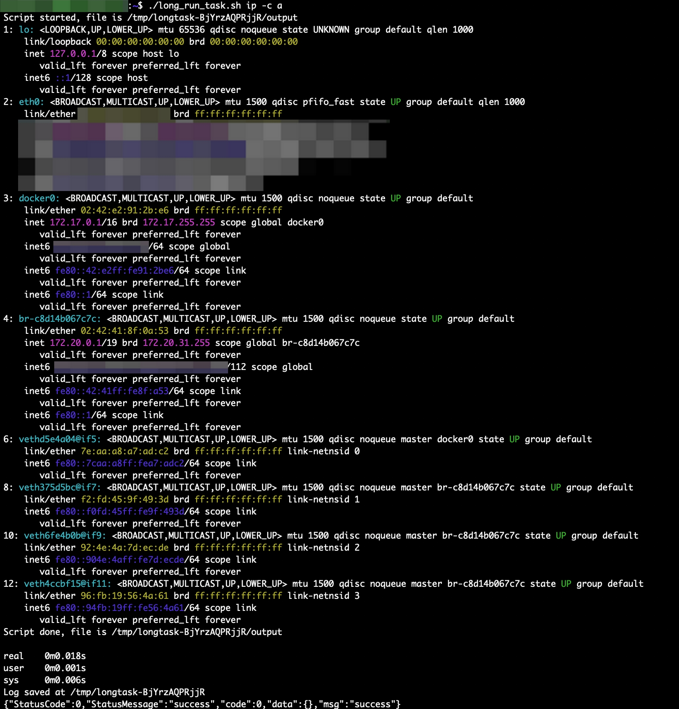
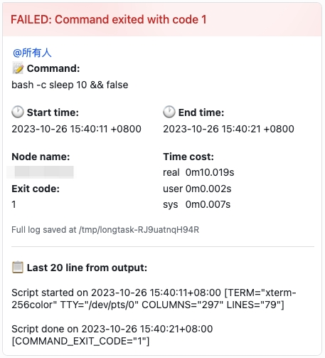
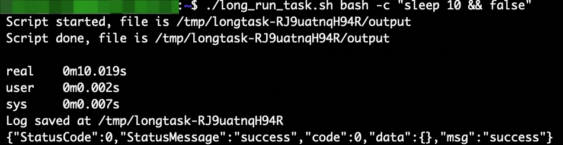

# task-notify.sh - capture final status and output of a possibly-long-running task

Some commands (such as `make`) take a long time to run. While waiting, you will want to leave the computer, but you also want to know the results of the command in time. This code solves this problem. You only need to find a Feishu group to add a custom robot and configure its webhook into this script. The command results run through this script (including the command exit code, the last 20 lines of output, start and end time, running time, and more) will be sent to Feishu group in time with `@all` at the end of the command.

有些命令（如make）要跑很长时间，在等待的时候会想离开电脑，但又想及时知道命令的结果。这个代码能够解决这一问题。只需要找一个飞书群添加自定义机器人，并将其 webhook 配置到这一脚本内，通过该脚本运行的命令结果——包含命令退出码、最后20行输出、开始结束时间、运行耗时等——都将在命令结束时及时发送到飞书群里并 at all。

## supported features

- capture basic information
- send to feishu group
- perserve exit code
- tty support
- terminal escape sequence filtering

**Contributions are welcomed!**

## prerequisites
**only tested on debian and macOS**
- python 3.x
- curl
- bash
- script

## usage
1. add feishu custom bot, get its webhook address
2. download the script task-notify.sh
3. edit task-notify.sh, change webhook address in `emit_message` function
4. `chmod +x task-notify.sh`
5. `./task-notify.sh sleep 5`
6. see output in feishu!

This script is designed to be called in any workdir. Say place it in `~/task-notify.sh`, you can run `~/task-notify.sh ls -alF` anywhere. Also, you can add this script to folder in path, like `/usr/local/bin`.

## screenshots

### example 1: succeeded `ip a` with colored output

### example 2: failed combined command

